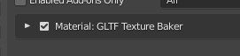
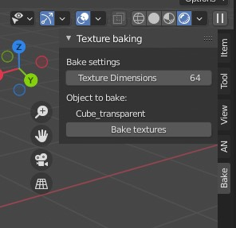
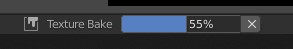

# GLTF Texture Baker

A Blender add-on for converting procedural materials into GLTF-ready baked textures.

Texture baking in Blender can be a tedious and time-consuming process, especially when multipled textures need to be baked. This add-on attempts to simplify the process for models that are intended for GLTF export. 

The add-on is **non-destructive**- it makes a copy of both the object and the material to be baked, so you don't need to worry about accidentally overwriting your procedural shaders. The baked textures are converted to images, and the new copy of the material has all procedural nodes cleaned up and deleted.

## Installation

* Download or clone this repository
* Open Blender, then go to Edit -> Preferences -> Add-ons
* Click the "Install" button in the upper-right, then navigate to this repository's texture_baker.py file
* An add-on titled "Material: GLTF Texture Baker" should appear: click the check mark on its left side to enable it

## Usage
In order to run the add-on at this time, you need an object which has:
* Exactly one material
* A Principled BSDF Shader within that material, which should be the only shader in use
* Exactly one UV map

Assuming those criteria are met, run the add-on as follows:
* Select the object to be baked in the 3d Viewport
* Open the sidebar in the 3d Viewport with 'n' and select the new 'Bake' tab from the add-on

* Set the desired dimensions for the baked textures. For textures with fine detail, something like 512 or 1024 is probably a good starting point - you can always re-bake with larger dimensions if necessary.
* When you're ready to bake, click the "Bake textures" button. This will copy the active object and its material, and start baking to that newly copied material. 
Bake progress for the **currently baking image** will be displayed as a percentage in the Blender UI, usually at the bottom. The baking runs in a separate thread, and so the UI should still be responsive, but it's probably best to wait until **all** textures have finished baking before doing other tasks.
If you need to cancel the current bake, you can click the 'x' next to the progress bar to stop the job.

## Updating the add-on

If you want to update to the newest version of the add-on, repeat the installation step (if you've already cloned the repository, you can pull instead of cloning, but you'll still need to reinstall the add-on in Blender with the new texture_baker.py file).